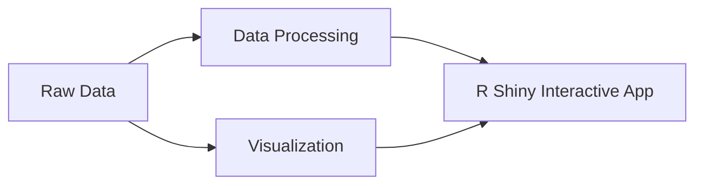

# Welcome to the Animal Welfare Database!
The code in this repository was written for the Computational Analyses Research Support Unit at Lethbridge Research Centre.



# Getting Started

## Prerequisites
The application requires connection to the VPN.

## Package
> The application was developed using `R` version 4.1.2.  

`shiny`  
`shinydashboard`  
`readxl`  
`plotly`  
`tidyverse`  
`here`  
`DT`

## File Directory Structure
```
.
├── rshinyapp v1.R
├── screenshots
|   ├── Sample Dataset.jpeg
|   ├── View Data.jpeg
|   ├── Upload.jpeg
|   ├── About.jpeg
├── Importing Access Database into R.R
├── LICENSE
└── README.md
```

# Usage
The application can be accessed on the RStudio Connect platform (https://agonottsklxsd069.agr.gc.ca/content/19/).

# Contact
Shefali Vishwakarma - ( [@ShefaliV_](https://twitter.com/ShefaliV_))  
Project Link: [Animal Welfare Database](https://github.com/shefcode/Animal-Welfare-Database)

# Acknowledgments
Shefali Vishwakarma (Simon Fraser University)  
Rodrigo Ortega Polo (Biology Study Leader - Bioinformatics, Agriculture and Agri-Food Canada)  
Xiaohui Yang
